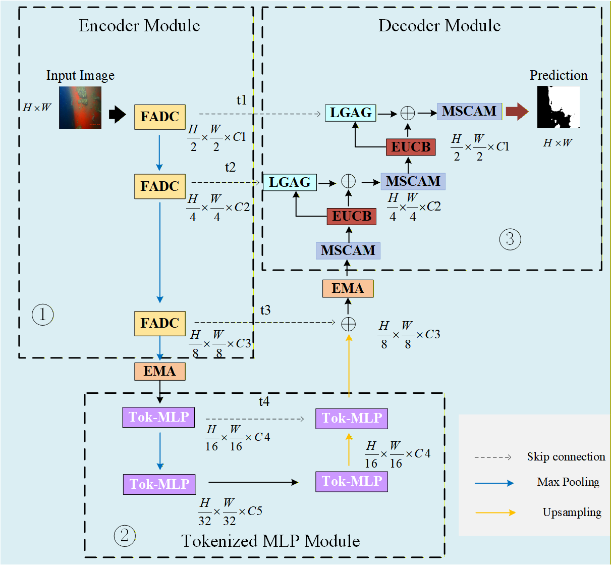

# FMA-UNeXt

Official PyTorch implementation of the manuscript:

**Frequency-Adaptive and Multi-Scale Attention Network for Underwater Hull Fouling Segmentation**

This repository corresponds directly to the manuscript currently submitted to *The Visual Computer*.

If you find this repository useful in your research, please consider citing the corresponding manuscript.

---

## Highlights

* Lightweight semantic segmentation framework for underwater hull fouling segmentation
* Based on the UNeXt architecture
* Integrates Frequency-Adaptive Dilated Convolution (FADC), Efficient Multi-scale Convolutional Attention Decoder (EMCAD), and Efficient Multi-Scale Attention (EMA)
* Designed for low-contrast underwater images and large-scale fouling regions
* Achieves 92.41% IoU, 96.03% DSC, and 96.14% Accuracy on the underwater hull fouling dataset

---

## Overview

Underwater hull fouling segmentation is challenging because underwater images often suffer from:

* Low contrast
* Uneven illumination
* Suspended particles and noise
* Large variations in fouling scales
* Strong similarity between fouling regions and background areas

To address these challenges, we propose FMA-UNeXt, an improved UNeXt-based semantic segmentation framework.

The proposed network consists of three key modules:

* **FADC**: Frequency-Adaptive Dilated Convolution for enhancing low-frequency structures and high-frequency details
* **EMCAD**: Efficient Multi-scale Convolutional Attention Decoder for reconstructing fouling regions with large scale variations
* **EMA**: Efficient Multi-Scale Attention for improving global-local feature fusion and large-region segmentation

---

## Network Architecture

<p align="center">
  
</p>


---

## Experimental Results

Performance of FMA-UNeXt on the underwater hull fouling segmentation task:

| Method    | IoU (%) | DSC (%) | Acc (%) | Params (M) | GFLOPs | Inference Speed (ms) |
| --------- | ------: | ------: | ------: | ---------: | -----: | -------------------: |
| UNeXt     |   85.84 |   92.19 |   92.95 |       1.47 |   0.57 |                 3.87 |
| FMA-UNeXt |   92.41 |   96.03 |   96.14 |       1.50 |   0.51 |                13.07 |

Compared with the original UNeXt, the proposed method improves:

* IoU by 6.57%
* DSC by 3.84%
* Accuracy by 3.19%

---

## Using the code:

The code is stable while using Python 3.6.13, CUDA >=10.1

- Clone this repository:
```bash
git clone https://github.com/lin2000921/fma-unext.git
cd fma-unext-master
```

To install all the dependencies using conda:

```bash
conda env create -f environment.yml
conda activate fma-unext
```

If you prefer pip, install following versions:

```bash
timm==0.3.2
mmcv-full==1.2.7
torch==1.7.1
torchvision==0.8.2
opencv-python==4.5.1.48
```

## Dataset

The dataset used in this study contains underwater hull fouling images captured by underwater cameras.Due to confidentiality restrictions related to ship hull condition data, the complete dataset cannot be publicly released.The dataset used in the manuscript contains 800 underwater hull fouling images, which were expanded to 13,920 images through data augmentation.
The dataset was divided into training, validation, and test sets with a ratio of 8:1:1.

## Data Format

Make sure to put the files as the following structure (e.g. the number of classes is 2):

```
inputs
└── <dataset name>
    ├── images
    |   ├── 001.png
    │   ├── 002.png
    │   ├── 003.png
    │   ├── ...
    |
    └── masks
        ├── 0
        |   ├── 001.png
        |   ├── 002.png
        |   ├── 003.png
        |   ├── ...
        |
        └── 1
            ├── 001.png
            ├── 002.png
            ├── 003.png
            ├── ...
```

For binary segmentation problems, just use folder 0.

### Notes

* Images and masks should have the same file names
* Folder `0` and folder `1` represent different segmentation categories

---


### Train

In `train.py`, replace these paths with your own dataset paths:

```python
train_path = r'YOUR_DATASET_PATH/image/train'
val_path = r'YOUR_DATASET_PATH/image/val'

train_img_dir = r'YOUR_DATASET_PATH/image/train'
train_mask_dir = r'YOUR_DATASET_PATH/mask/train'

val_img_dir = r'YOUR_DATASET_PATH/image/val'
val_mask_dir = r'YOUR_DATASET_PATH/mask/val'
````

Set the experiment name with `--name`. For example:

```bash
python train.py --dataset wusun --arch UNext --name fma_unext_exp --img_ext .png --mask_ext .png --lr 0.001 --epochs 300 --input_w 256 --input_h 256 -b 16
```

The trained model and logs will be saved in:

```text
models/fma_unext_exp/
```

### Validation

In `val.py`, replace these paths with your own validation dataset paths:

```python
val_path = r'YOUR_DATASET_PATH/image/val'

val_img_dir = r'YOUR_DATASET_PATH/image/val'
val_mask_dir = r'YOUR_DATASET_PATH/mask/val'
```

The `--name` in `val.py` should be the same as the training experiment name, for example:

```python
parser.add_argument('--name', default='fma_unext_exp',
                    help='model name')
```

Or run directly:

```bash
python val.py --name fma_unext_exp
```

The prediction results will be saved in:

```text
outputs/fma_unext_exp/
```

### Evaluation

The evaluation metrics used in this project include **IoU**, **DSC**, and **Accuracy (Acc)**.

* **IoU** and **DSC** are computed in `val.py` during validation.
* **Acc** should be evaluated separately by running `acc_test.py`.

After validation, you can evaluate Accuracy using:

```bash
python acc_test.py
```

Please make sure that the paths and model settings in `acc_test.py` are consistent with your trained experiment before running it.

```
```


## Reproducibility

This repository provides the source code, environment configuration, training and validation scripts, and documentation required to reproduce the main experiments reported in the manuscript.

Due to confidentiality restrictions related to ship hull condition data, the full dataset cannot be publicly released. However, the dataset organization, training procedure, and evaluation process are described in this repository to facilitate reproducibility.

---

### Acknowledgements

This codebase adopts certain code blocks and helper functions from [UNeXt](https://github.com/jeya-maria-jose/UNeXt-pytorch). We sincerely thank the original authors for making their implementation publicly available.

---

## Contact

For questions related to the code or manuscript, please contact:

* Yihao Lin: [linyihao@mail.shiep.edu.cn](mailto:linyihao@mail.shiep.edu.cn)
